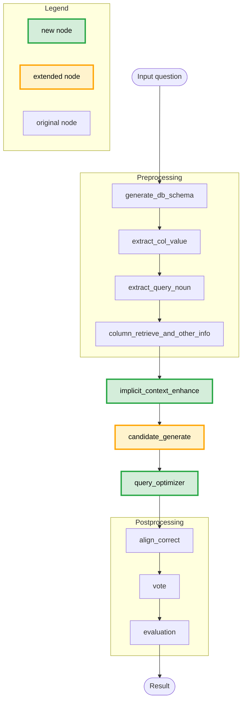
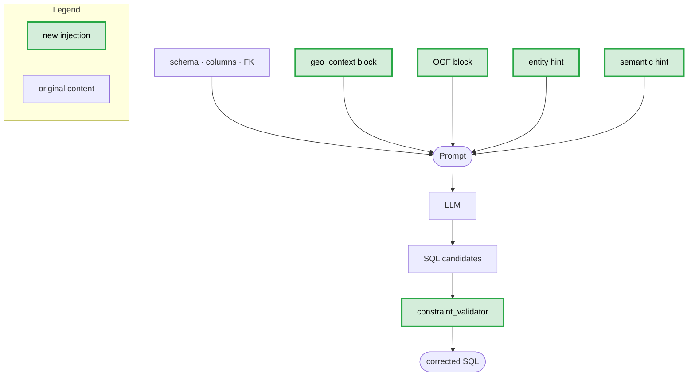

# OpenSearch-SQL (with plugins)
A comprehensive Text-to-SQL framework that achieved first place on [BIRD](https://bird-bench.github.io/) in August 2024. Below is the complete flowchart.
<p align="center">
  
</p>
<div align="center">
  

</div>

## Pipeline

### Overall flowchart with domain extensions highlighted:


### Detailed chart of enhanced `candidate_generate` node:



| Node | Role |
| --- | --- |
| `generate_db_schema` | Embed schema columns with sentence-transformer |
| `extract_col_value` | Identify relevant columns and values from the question |
| `extract_query_noun` | Parse `#columns:` / `#values:` markers |
| `column_retrieve_and_other_info` | Top-k schema linking via BERT similarity |
| **`implicit_context_enhance`** | **Inject geo context + ontology grounding** _(domain extension)_ |
| **`candidate_generate`** | **Beam-search SQL candidates + entity/semantic hints** _(domain extension)_ |
| **`sql_audit`** | **Constraint validation of generated SQL candidates** _(domain extension)_ |
| **`query_optimizer`** | **Rewrite large lat/lon IN-lists to VALUES JOIN** _(domain extension, `full` only)_ |
| `align_correct` | Style & function alignment across candidates |
| `vote` | Self-consistency selection |
| `evaluation` | Execution match (EX) scoring |

**Ablation modes** — each mode incrementally enables the domain extensions:

| Mode | Geo context | Ontology grounding | Entity hint | Semantic hint | SQL validator | Query optimizer |
| --- | :---: | :---: | :---: | :---: | :---: | :---: |
| `baseline` | | | | | | |
| `a1` | ✓ | | | | | |
| `a2` | ✓ | ✓ | | | | |
| `a3` | ✓ | ✓ | ✓ | | | |
| `a4` | ✓ | ✓ | ✓ | ✓ | | |
| `a5` | ✓ | ✓ | ✓ | ✓ | ✓ | |
| `full` | ✓ | ✓ | ✓ | ✓ | ✓ | ✓ |

---

## Overview

OpenSearch-SQL consists of modules for Preprocessing, Extraction, Generation, Refinement, and Alignment. The entire framework operates without additional training; GPT, DeepSeek, Gemini, Qwen, and other LLMs are supported.

## Installation

```shell
uv sync
```

> This project uses [uv](https://docs.astral.sh/uv/) for dependency management. All commands below use `uv run`.

---

## Setup: Generate Embeddings

Column-value embeddings must be generated once before running evaluations. They are read by the `column_retrieve_and_other_info` node for schema linking.

**Requirements:** a running PostgreSQL instance with env vars set (see `.env`):

```
DB_HOST=...  DB_PORT=5432  DB_NAME=meteo  DB_USER=...  DB_PASS=...
DB_SCHEMA=public          # optional, default: public
```

```shell
uv run src/database_process/make_emb.py \
    --emb_dir data/emb \
    --db_name meteo \
    --bert_model all-mpnet-base-v2 \
    --env_file .env
```

Output: `data/emb/meteo.pkl.gz` and `data/emb/meteo_value.pkl.gz`

| Flag | Default | Description |
|---|---|---|
| `--emb_dir` | required | Output directory for `.pkl.gz` files |
| `--db_name` | `meteo` | Logical database name |
| `--bert_model` | `all-mpnet-base-v2` | SentenceTransformer model |
| `--env_file` | `.env` | Path to `.env` file with DB credentials |

---

## Running Evaluations

### Single configuration — `run_eval.py`

```shell
# Default: dataset=landcover10, ablation=full, end=1 (first question only)
uv run run/run_eval.py

# Run all questions with Swiss AI provider
uv run run/run_eval.py --dataset landcover10 --ablation full --end -1 --provider swiss_ai

# Custom YAML config
uv run run/run_eval.py --llm-config config/models.yaml --dataset landcover10 --end -1

# Dry-run: print resolved config without executing
uv run run/run_eval.py --dry-run
```

**Key flags:**

| Flag | Default | Description |
|---|---|---|
| `--dataset` | `landcover10` | Dataset name or path (see below) |
| `--ablation` | `full` | Ablation mode (see table below) |
| `--start` / `--end` | `0` / `1` | Question index range; `-1` = all |
| `--llm-config` | `config/models.yaml` | Path to LLM YAML config |
| `--provider` | — | Quick provider override (no YAML needed) |
| `--model` | — | Model name (used with `--provider`) |
| `--n-candidates` | `5` | SQL candidates per question |
| `--temperature` | `0.7` | Sampling temperature |
| `--fewshot` | off | Enable few-shot examples |
| `--geo-anchor` | `points` | Geo anchor mode (`points` or `bbox`) |
| `--export-xlsx` | off | Export results to XLSX after run |
| `--skip-existing` | off | Skip if result directory already exists |
| `--dry-run` | off | Print config without running |
| `--bert-model` | `all-mpnet-base-v2` | Sentence-transformer model |

**Dataset resolution** (`--dataset`):
- Name only (e.g. `landcover10`) → `src/database_process/landcover10.json`
- Relative path (e.g. `data/data_preprocess/my.json`) → relative to `src/OpenSearch-SQL/`
- Absolute path → used as-is

### Full ablation suite — `run_ablation.py`

Runs all ablation modes sequentially, forwarding all `run_eval.py` flags:

```shell
# All modes, default dataset
uv run run/run_ablation.py

# Specific modes only
uv run run/run_ablation.py --modes a3,a4,full

# Swiss AI, all questions
uv run run/run_ablation.py --provider swiss_ai --end -1 --export-xlsx

# With skip-existing to resume interrupted runs
uv run run/run_ablation.py --skip-existing --end -1
```

### Ablation modes

Each mode incrementally adds pipeline components:

| Mode | Geo context | Ontology grounding | Entity hint | Semantic hint | SQL validator | Query optimizer |
| --- | :---: | :---: | :---: | :---: | :---: | :---: |
| `baseline` | | | | | | |
| `a1` | ✓ | | | | | |
| `a2` | ✓ | ✓ | | | | |
| `a3` | ✓ | ✓ | ✓ | | | |
| `a4` | ✓ | ✓ | ✓ | ✓ | | |
| `a5` | ✓ | ✓ | ✓ | ✓ | ✓ | |
| `full` | ✓ | ✓ | ✓ | ✓ | ✓ | ✓ |

---

## LLM Provider Configuration

### `config/models.yaml` (default)

```yaml
provider: openai          # openai | bedrock | swiss_ai | ollama | anthropic
model: gpt-4o
temperature: 0.0
```

### Supported providers

| Provider | `--provider` value | Required env vars |
|---|---|---|
| OpenAI | `openai` | `OPENAI_API_KEY` |
| AWS Bedrock | `bedrock` | `AWS_ACCESS_KEY_ID`, `AWS_SECRET_ACCESS_KEY`, `AWS_REGION` |
| Swiss AI (CSCS) | `swiss_ai` | `SWISS_AI_BASE_URL`, `SWISS_AI_API_KEY`, `SWISS_AI_MODEL` |
| Ollama (local) | `ollama` | — |
| Anthropic | `anthropic` | `ANTHROPIC_API_KEY` |

### Swiss AI (Qwen3 on CSCS vLLM)

Copy `config/models_swiss.yaml` or pass `--provider swiss_ai`:

```yaml
# config/models_swiss.yaml
provider: swiss_ai
model: "Qwen/Qwen3.5-27B"
temperature: 0.0
enable_thinking: false       # suppress Qwen3 chain-of-thought output
use_structured_output: true  # use JSON format for extract_col_value
```

```shell
uv run run/run_eval.py --llm-config config/models_swiss.yaml --dataset landcover10 --end -1
# or shorthand:
uv run run/run_eval.py --provider swiss_ai --end -1
```

### Quick provider override

Use `--provider` (and optionally `--model`) without creating a YAML file:

```shell
uv run run/run_eval.py --provider openai --model gpt-4o --end -1
uv run run/run_eval.py --provider swiss_ai --model Qwen/Qwen3.5-27B --end -1
```

---

## Dataset Sampling

Prepare a stratified sample from an XLSX file into pipeline-ready JSON:

```shell
# Sample 2 questions per category, both point and bbox variants
uv run src/database_process/sample_dataset.py \
    --input-file Thessaly_NOA.xlsx \
    --output-file thesaly_sample \
    --mode both

# Point only, 3 samples per category
uv run src/database_process/sample_dataset.py \
    --input-file Thessaly_NOA.xlsx \
    --output-file heat_wave_point \
    --mode point --n 3
```

Output files are written to `src/OpenSearch-SQL/data/data_preprocess/`:
- `{output-file}_point.json`
- `{output-file}_bbox.json`

**Input file resolution:** filename only → `data/` (project root); relative path → relative to cwd; absolute → used as-is.

**Flags:**

| Flag | Default | Description |
|---|---|---|
| `--input-file` | required | XLSX filename or path |
| `--output-file` | required | Output stem (suffix `_point`/`_bbox` added) |
| `--mode` | `both` | `point`, `bbox`, or `both` |
| `--n` | `2` | Samples per category |
| `--seed` | `42` | Random seed |
| `--question-col` | `question_generated` | Question column name |
| `--category-col` | `category` | Category column name |
| `--point-sql-col` | `point_sql` | Point SQL column name |
| `--bbox-sql-col` | `bbox_sql` | Bbox SQL column name |

